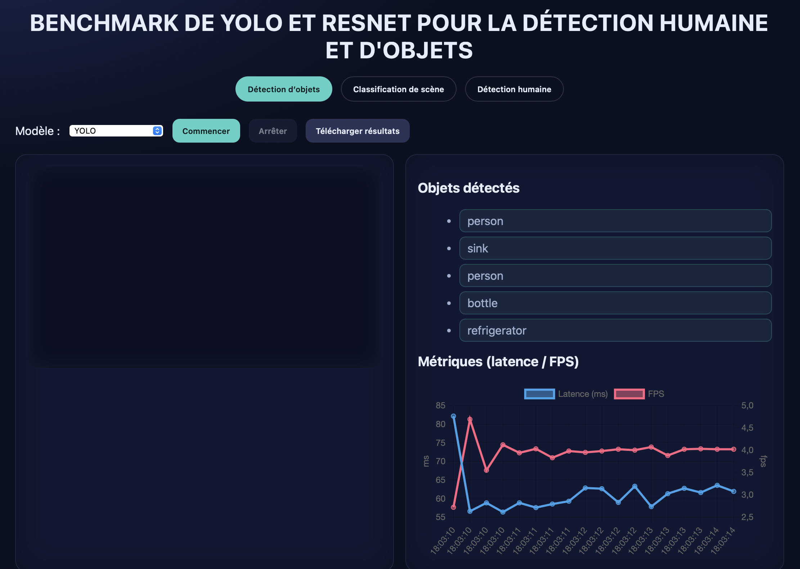

# Projet Video – Benchmark de YOLO et ResNet pour la détection d'objets, de scènes et d'humain  

## Description  
Ce projet est une application **Flask** qui permet de comparer en temps réel les performances de plusieurs modèles de vision par ordinateur :  
- **YOLOv8** : détection d’objets  
- **ResNet (ImageNet)** : classification simplifiée d’objets  
- **ResNet Places365** : classification de scènes  
- **YOLOv8 Pose** et **Faster R-CNN ResNet50 (COCO)** : détection humaine (boîtes englobantes et points clés)  

L’interface web (HTML/JS + Flask backend) capture le flux vidéo de la caméra, envoie les images aux modèles, puis affiche :  
- les objets / scènes détectés,  
- les métriques (latence, FPS),  
- les visualisations (graphiques et overlay sur la vidéo).  

Une page de consentement s’affiche avant l’accès au benchmark.  

---

## Structure du projet  

```
Projet video/
│── static/
│   └── styles.css              # Feuille de style
│
│── templates/
│   ├── benchmark.html           # Interface principale du benchmark
│   └── consent.html             # Page de consentement
│
│── app.py                       # Backend Flask + API pour les modèles
│── requirement.txt              # Dépendances Python
│
│── yolov8n.pt                   # Modèle YOLOv8 (objets)
│── yolov8n-pose.pt              # Modèle YOLOv8 (pose humaine)
│── resnet50_places365.pth       # Checkpoint ResNet Places365
│── categories_places365.txt     # Labels Places365
│── imagenet_classes.txt         # Labels ImageNet
```

---

## Installation  

### 1. Cloner le projet  
```bash
git clone <repo-url>
cd Projet\ video
```

### 2. Créer un environnement virtuel (optionnel mais recommandé)  
```bash
python -m venv venv
source venv/bin/activate   # macOS/Linux
venv\Scripts\activate      # Windows
```

### 3. Installer les dépendances  
```bash
pip install -r requirement.txt
```

Contenu du `requirement.txt` :  
```
flask
pillow
torch
torchvision
ultralytics
numpy
```

Pour bénéficier de l’accélération GPU, installe PyTorch avec la bonne version CUDA depuis :  
[https://pytorch.org/get-started/locally](https://pytorch.org/get-started/locally)  

---

## Utilisation  

### Lancer l’application Flask  
```bash
python app.py
```

Par défaut, l’application sera accessible sur :  
[http://127.0.0.1:5000](http://127.0.0.1:5000)  

### Étapes :  
1. Accepter les **conditions d’utilisation** (page consent.html).  
2. Accéder à l’interface principale (`benchmark.html`).  
3. Choisir un onglet :  
   - **Détection d’objets (YOLO/ResNet)**  
   - **Classification de scène (Places365)**  
   - **Détection humaine (YOLOv8-Pose/Faster R-CNN)**  
4. Lancer/arrêter le benchmark.  
5. Télécharger les résultats en CSV.  

---

## Fonctionnalités  
- **Détection d’objets** (YOLO, ResNet)  
- **Classification de scènes** (ResNet Places365)  
- **Détection humaine** (YOLOv8-Pose avec squelettes + Faster R-CNN avec boîtes)  
- **Métriques en temps réel** : latence (ms) & FPS  
- **Visualisations** avec Chart.js  
- **Export des résultats** au format CSV  

---

## Confidentialité & Consentement  
- L’application utilise **uniquement la caméra locale**.  
- Aucune donnée n’est envoyée vers un serveur externe.  
- Les images traitées ne sont pas stockées.  
- Les seules données conservées localement (CSV) concernent :  
  - latence par image  
  - FPS  
  - objets/scènes détectés  

---

## Pré-requis  
- Python 3.9+  
- Navigateur compatible avec `getUserMedia` (Chrome, Firefox, Edge)  
- Webcam fonctionnelle  

---


Ce projet est un **outil expérimental** destiné à l’évaluation et à l’apprentissage. 

## Apercu

